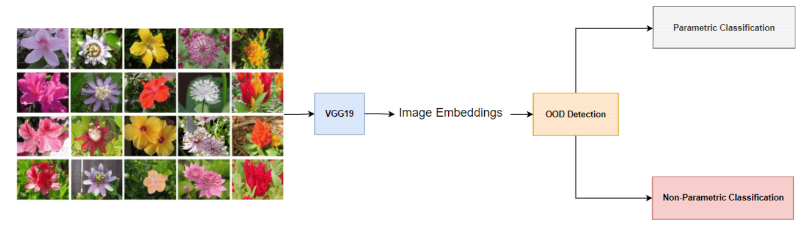

# deep-class-aware-ood
a cross-validation approach to finding out-of-distribution uncertainty thresholds for open-set recognition.

## Updata
Me and [Alireza Gargoori Motlagh](https://github.com/alireza7agm) hope to continue this work as a research project! Currently, our main ideas are using self-supervised embeddings for finding class centroids, and using the entropy of the distribution of distances to centroids as a measure of the uncertainty for prediction. See the SSL+OOD Jupyter notebook for an experiment using Dino on CIFAR-10 -> SVHN (Dino has recently been interpreted as a von Mises-Fisher mixture model. See [this](https://openreview.net/forum?id=cMJo1FTwBTQ) paper). 

## Introduction
This repository holds the code for the final project of the graduate course "Statistical Machine Learning" at the computer engineering department of Sharif University of Technology. The goal of the project is to apply open-set recognition to the Oxford-102 dataset. We first implemented several uncertainty estimation methods, some of which were our own ideas. To get an estimation of what constitutes an out-of-distribution threshold, we developed the "cross-class-validation" approach. The approach consists of:

1. Putting aside one of the seen classes.
2. Finding the threshold that best separates the separated class from the available seen classes (F1 score is used here to find the threshold with the highest in and out-of distribution detection accuracy).
3. The process is repeated for all classes to find the threshold with the best average F1 accuracy across all classes.

We then applied Bayesian nonparametric approaches such as the Bayesian GMM with a Dirichlet prior to clustering the unseen data. 

## Results
The uncertainty estimation method worked perfectly and consistently across all of the uncertainty estimation algorithms we used, almost always finding the best possible threshold one could manually set. The bottleneck for the final result seemed to be the Bayesian nonparametric approach to clustering with a Dirichlet prior on the number of classes. The BGMM model in our project didn't work very well.

## Other Information
The feature extractor in our project is a classic VGG-19 trained on ImageNet-1K. All of the code is in Pytorch. The collaborators on this project were Alireza Gargoori Motlagh and Mohammad Mahdi Asmae.

